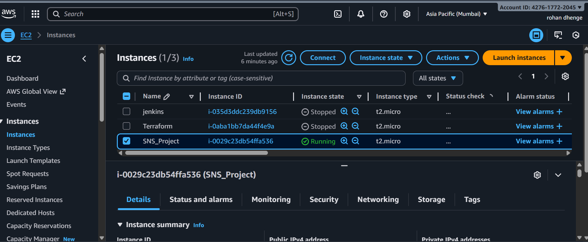
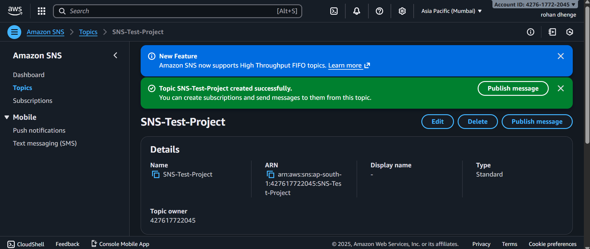

# 📩 SNS Email Notification Project (Node.js + AWS)

This project demonstrates how to send email notifications using **AWS SNS** integrated with a **Node.js application** hosted on an EC2 instance.

---

## 🚀 Project Workflow

- Create EC2 Instance  
- Install Node.js  
- Create SNS Topic  
- Add Email Subscription  
- Create IAM Role  
- Attach Role to EC2  
- Deploy Node.js App  
- Send Email via HTML Form  

---

# 🛠️ Installation Steps

## ✅ Step 1: Install Node.js on EC2
```bash
sudo yum install -y nodejs
node -v
npm -v
````

## ✅ Step 2: Initialize Node App

```bash
npm init -y
npm install express aws-sdk body-parser
```

---

## ✅ Step 3: Create `app.js`


## ✅ Step 4: Create `index.html`


## ✅ Step 5: Run App

```bash
node app.js
```

Visit:

```
http://<EC2-Public-IP>:3000
```

Allow port **3000** in Security Group.

---

# 📸 Project Screenshots


### EC2 Instance



### SNS Topic



### IAM Role


### Email Subscription


### Website Dashboard


### Success Message


### Email Received


---

# 🎉 Final Result

✔ SNS Topic Created
✔ Email Subscription Confirmed
✔ Node App Running
✔ Email Delivered Successfully

---


